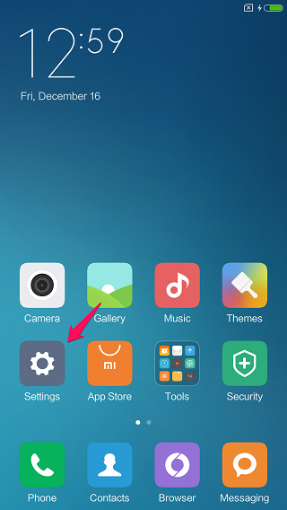
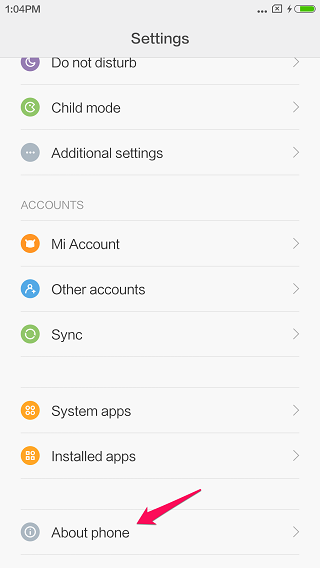
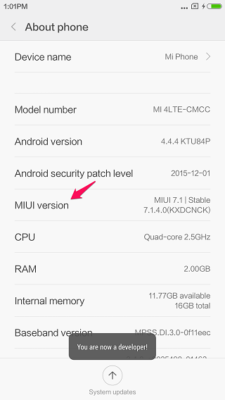
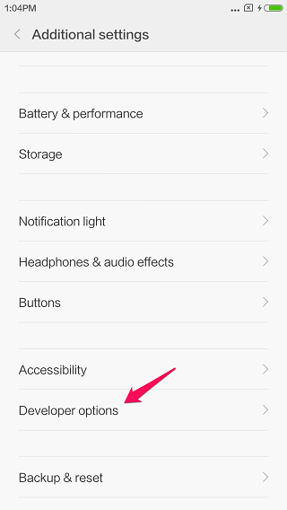

# Guide
## 1 How to enable developer mode
1.1 Find Settings in your android phone.

1.2 Select About phone.

1.3 Tap MIUI Version 7 times. If you use other devices, try tap Build number.

1.4 Go back main Settings page and click additional settings, then select Developer options.

1.5 Enable USB debugging

1.6 Select OK to confirm.
